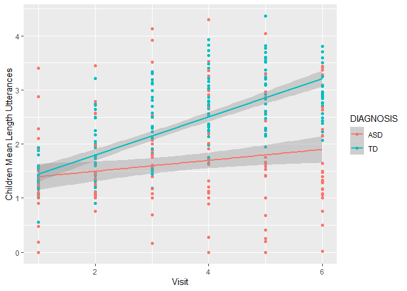
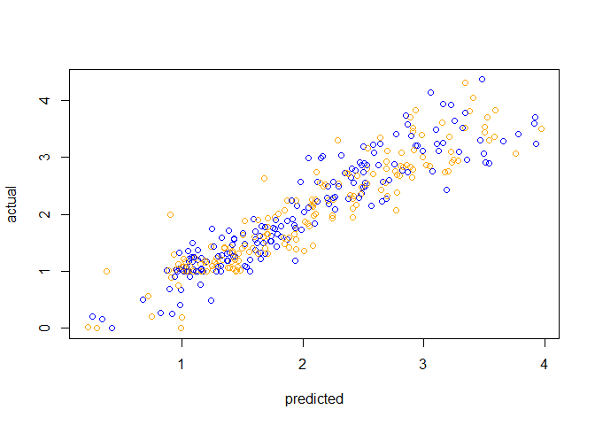
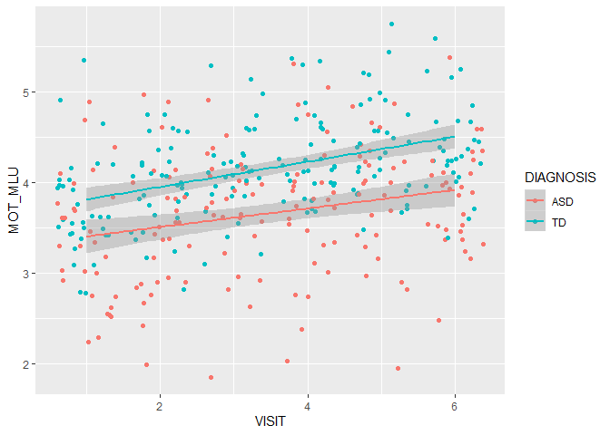

Assignment 2
============

In this assignment you will have to discuss a few important questions
(given the data you have). More details below. The assignment submitted
to the teachers consists of: - a report answering and discussing the
questions (so we can assess your conceptual understanding and ability to
explain and critically reflect) - a link to a git repository with all
the code (so we can assess your code)

Part 1 - Basic description of language development - Describe your
sample (n, age, gender, clinical and cognitive features of the two
groups) and critically assess whether the groups (ASD and TD) are
balanced - Describe linguistic development (in terms of MLU over time)
in TD and ASD children (as a function of group). - Describe how parental
use of language (in terms of MLU) changes over time. What do you think
is going on? - Include individual differences in your model of language
development (in children). Identify the best model.

Part 2 - Model comparison - Discuss the differences in performance of
your model in training and testing data - Which individual differences
should be included in a model that maximizes your ability to
explain/predict new data? - Predict a new kid’s performance (Bernie) and
discuss it against expected performance of the two groups

Part 3 - Simulations to plan a new study - Report and discuss a power
analyses identifying how many new kids you would need to replicate the
results

The following involves only Part 1.

Learning objectives
-------------------

-   Summarize and report data and models
-   Critically apply mixed effects (or multilevel) models
-   Explore the issues involved in feature selection

Quick recap
===========

Autism Spectrum Disorder is often related to language impairment.
However, this phenomenon has not been empirically traced in detail: i)
relying on actual naturalistic language production, ii) over extended
periods of time.

We therefore videotaped circa 30 kids with ASD and circa 30 comparison
kids (matched by linguistic performance at visit 1) for ca. 30 minutes
of naturalistic interactions with a parent. We repeated the data
collection 6 times per kid, with 4 months between each visit. We
transcribed the data and counted: i) the amount of words that each kid
uses in each video. Same for the parent. ii) the amount of unique words
that each kid uses in each video. Same for the parent. iii) the amount
of morphemes per utterance (Mean Length of Utterance) displayed by each
child in each video. Same for the parent.

This data is in the file you prepared in the previous class.

NB. A few children have been excluded from your datasets. We will be
using them next week to evaluate how good your models are in assessing
the linguistic development in new participants.

This RMarkdown file includes 1) questions (see above). Questions have to
be answered/discussed in a separate document that you have to directly
send to the teachers. 2) A break down of the questions into a guided
template full of hints for writing the code to solve the exercises. Fill
in the code and the paragraphs as required. Then report your results in
the doc for the teachers.

REMEMBER that you will have to have a github repository for the code and
send the answers to Kenneth and Riccardo without code (but a link to
your github/gitlab repository). This way we can check your code, but you
are also forced to figure out how to report your analyses :-)

Before we get going, here is a reminder of the issues you will have to
discuss in your report:

1- Describe your sample (n, age, gender, clinical and cognitive features
of the two groups) and critically assess whether the groups (ASD and TD)
are balanced 2- Describe linguistic development (in terms of MLU over
time) in TD and ASD children (as a function of group). 3- Describe how
parental use of language (in terms of MLU) changes over time. What do
you think is going on? 4- Include individual differences in your model
of language development (in children). Identify the best model.

Let’s go
========

### Loading the relevant libraries

Load necessary libraries : what will you need? - e.g. something to deal
with the data - e.g. mixed effects models - e.g. something to plot with

### Define your working directory and load the data

If you created a project for this class and opened this Rmd file from
within that project, your working directory is your project directory.

If you opened this Rmd file outside of a project, you will need some
code to find the data: - Create a new variable called locpath
(localpath) - Set it to be equal to your working directory - Move to
that directory (setwd(locpath)) - Load the data you saved last time (use
read\_csv(fileName))

``` r
# Loading data
df <- read_csv("LangDevASD.csv")
```

    ## Warning: Missing column names filled in: 'X1' [1]

    ## Parsed with column specification:
    ## cols(
    ##   .default = col_double(),
    ##   ETHNICITY = col_character(),
    ##   DIAGNOSIS = col_character(),
    ##   GENDER = col_character()
    ## )

    ## See spec(...) for full column specifications.

``` r
# Deleting first column
df <- df[,-1]
```

### Characterize the participants (Exercise 1)

Identify relevant variables: participants demographic characteristics,
diagnosis, ADOS, Verbal IQ, Non Verbal IQ, Socialization, Visit, Number
of words used, Number of unique words used, mean length of utterance in
both child and parents.

Make sure the variables are in the right format.

Describe the characteristics of the two groups of participants and
whether the two groups are well matched.

``` r
# Checking the formats of the variables
str(df)
```

    ## Classes 'tbl_df', 'tbl' and 'data.frame':    372 obs. of  20 variables:
    ##  $ SUBJ              : num  1 1 1 1 1 1 2 2 2 2 ...
    ##  $ ADOS1             : num  0 0 0 0 0 0 13 13 13 13 ...
    ##  $ SOCIALIZATION1    : num  108 108 108 108 108 108 85 85 85 85 ...
    ##  $ MULLENRAW1        : num  28 28 28 28 28 28 34 34 34 34 ...
    ##  $ EXPRESSIVELANGRAW1: num  14 14 14 14 14 14 27 27 27 27 ...
    ##  $ VISIT             : num  1 2 3 4 5 6 1 2 3 4 ...
    ##  $ ETHNICITY         : chr  "White" "White" "White" "White" ...
    ##  $ DIAGNOSIS         : chr  "TD" "TD" "TD" "TD" ...
    ##  $ GENDER            : chr  "M" "M" "M" "M" ...
    ##  $ AGE               : num  19.8 23.9 27.7 32.9 35.9 ...
    ##  $ ADOS              : num  0 NA NA NA 0 NA 13 NA NA NA ...
    ##  $ SOCIALIZATION     : num  108 110 109 102 107 100 85 105 77 75 ...
    ##  $ MULLENRAW         : num  28 NA NA 33 NA 42 34 NA NA 49 ...
    ##  $ EXPRESSIVELANGRAW : num  14 NA NA NA NA 44 27 NA NA NA ...
    ##  $ MOT_MLU           : num  3.62 3.86 4.32 4.42 5.21 ...
    ##  $ CHI_MLU           : num  1.25 1.01 1.56 2.25 3.24 ...
    ##  $ TYPES_MOT         : num  378 403 455 533 601 595 317 307 351 335 ...
    ##  $ TYPES_CHI         : num  14 18 97 133 182 210 146 171 262 200 ...
    ##  $ TOKENS_MOT        : num  1835 2160 2149 2260 2553 ...
    ##  $ TOKENS_CHI        : num  139 148 255 321 472 686 461 562 983 674 ...

``` r
# Changing the formats of the variables
df$SUBJ <- as.factor(df$SUBJ)
df$VISIT <- as.integer(df$VISIT)
df$DIAGNOSIS <- as.factor(df$DIAGNOSIS)
df$GENDER <- as.factor(df$GENDER)

# Subsetting the dataset to only include visit one (to only care about the x number of participants, and not all 372 data points)
df1 <-
  df %>% 
  filter(VISIT == 1)
# 66 observations = 66 participants

# Getting the number of participants within each group (diagnosis) and the mean of their age
df1 %>% 
  group_by(DIAGNOSIS) %>% 
  summarise(N = n(),
  mAGE = mean (AGE, na.rm = T),
  sdAGE = sd(AGE, na.rm = T),
  femaleN = sum (GENDER == "F"),
  verbalIQ = mean(EXPRESSIVELANGRAW1, na.rm = T),
  sdverbalIQ = sd(EXPRESSIVELANGRAW1, na.rm = T),
  nonverbalIQ = mean(MULLENRAW1, na.rm = T),
  sdnonverbalIQ = sd(MULLENRAW1, na.rm = T))
```

    ## # A tibble: 2 x 9
    ##   DIAGNOSIS     N  mAGE sdAGE femaleN verbalIQ sdverbalIQ nonverbalIQ
    ##   <fct>     <int> <dbl> <dbl>   <int>    <dbl>      <dbl>       <dbl>
    ## 1 ASD          31  33.0  5.42       5     17.8       7.74        26.9
    ## 2 TD           35  20.4  1.57       6     20         5.05        25.8
    ## # ... with 1 more variable: sdnonverbalIQ <dbl>

``` r
# ASD = 31 (mean age = 33.04 months), TD = 35 (mean age = 20.38 months)
```

Let’s test hypothesis 1: Children with ASD display a language impairment (Exercise 2)
-------------------------------------------------------------------------------------

### Hypothesis: The child’s MLU changes: i) over time, ii) according to diagnosis

Let’s start with a simple mixed effects linear model

Remember to plot the data first and then to run a statistical test. -
Which variable(s) should be included as fixed factors? - Which
variable(s) should be included as random factors?

``` r
# Making a plot
ggplot(df, aes(VISIT, CHI_MLU, colour = DIAGNOSIS)) +
  geom_point()+
  geom_smooth(method = lm)+
  ylab("Children Mean Length Utterances")+
  xlab("Visit")
```

    ## Warning: Removed 20 rows containing non-finite values (stat_smooth).

    ## Warning: Removed 20 rows containing missing values (geom_point).



``` r
# Running a statistical test with "Visit" and "Diagnosis" as fixed effects. And Subject as random factor - included as random intercept and slope (not just the intercept can be different - the children can also vary in the rate of development).
h1.1 <- lmer(CHI_MLU ~ VISIT * DIAGNOSIS + (1 + VISIT|SUBJ), df, REML = F)
summary(h1.1)
```

    ## Linear mixed model fit by maximum likelihood . t-tests use
    ##   Satterthwaite's method [lmerModLmerTest]
    ## Formula: CHI_MLU ~ VISIT * DIAGNOSIS + (1 + VISIT | SUBJ)
    ##    Data: df
    ## 
    ##      AIC      BIC   logLik deviance df.resid 
    ##    572.5    603.4   -278.2    556.5      344 
    ## 
    ## Scaled residuals: 
    ##      Min       1Q   Median       3Q      Max 
    ## -2.48471 -0.53247 -0.08812  0.44178  2.73713 
    ## 
    ## Random effects:
    ##  Groups   Name        Variance Std.Dev. Corr 
    ##  SUBJ     (Intercept) 0.29423  0.5424        
    ##           VISIT       0.01122  0.1059   -0.16
    ##  Residual             0.16063  0.4008        
    ## Number of obs: 352, groups:  SUBJ, 61
    ## 
    ## Fixed effects:
    ##                   Estimate Std. Error       df t value Pr(>|t|)    
    ## (Intercept)        1.30459    0.12273 59.16038  10.629 2.40e-15 ***
    ## VISIT              0.10046    0.02680 61.43010   3.749 0.000395 ***
    ## DIAGNOSISTD       -0.21693    0.16953 59.25757  -1.280 0.205668    
    ## VISIT:DIAGNOSISTD  0.25331    0.03712 61.98667   6.823 4.35e-09 ***
    ## ---
    ## Signif. codes:  0 '***' 0.001 '**' 0.01 '*' 0.05 '.' 0.1 ' ' 1
    ## 
    ## Correlation of Fixed Effects:
    ##             (Intr) VISIT  DIAGNO
    ## VISIT       -0.443              
    ## DIAGNOSISTD -0.724  0.321       
    ## VISIT:DIAGN  0.320 -0.722 -0.445

How would you evaluate whether the model is a good model?

``` r
# Creating a basic model
h1.0 <- lmer(CHI_MLU ~ VISIT + DIAGNOSIS + (1 + VISIT|SUBJ), df, REML = F)
summary(h1.0)
```

    ## Linear mixed model fit by maximum likelihood . t-tests use
    ##   Satterthwaite's method [lmerModLmerTest]
    ## Formula: CHI_MLU ~ VISIT + DIAGNOSIS + (1 + VISIT | SUBJ)
    ##    Data: df
    ## 
    ##      AIC      BIC   logLik deviance df.resid 
    ##    605.4    632.5   -295.7    591.4      345 
    ## 
    ## Scaled residuals: 
    ##      Min       1Q   Median       3Q      Max 
    ## -2.46814 -0.57283 -0.08581  0.43291  2.70985 
    ## 
    ## Random effects:
    ##  Groups   Name        Variance Std.Dev. Corr 
    ##  SUBJ     (Intercept) 0.35391  0.5949        
    ##           VISIT       0.02688  0.1640   -0.41
    ##  Residual             0.16132  0.4016        
    ## Number of obs: 352, groups:  SUBJ, 61
    ## 
    ## Fixed effects:
    ##             Estimate Std. Error       df t value Pr(>|t|)    
    ## (Intercept)  1.03849    0.12045 61.61977   8.622 3.49e-12 ***
    ## VISIT        0.23352    0.02454 60.78195   9.516 1.19e-13 ***
    ## DIAGNOSISTD  0.29005    0.15175 60.08450   1.911   0.0607 .  
    ## ---
    ## Signif. codes:  0 '***' 0.001 '**' 0.01 '*' 0.05 '.' 0.1 ' ' 1
    ## 
    ## Correlation of Fixed Effects:
    ##             (Intr) VISIT 
    ## VISIT       -0.408       
    ## DIAGNOSISTD -0.661 -0.001

``` r
# Comparing the null and full model
anova(h1.0, h1.1)
```

    ## Data: df
    ## Models:
    ## h1.0: CHI_MLU ~ VISIT + DIAGNOSIS + (1 + VISIT | SUBJ)
    ## h1.1: CHI_MLU ~ VISIT * DIAGNOSIS + (1 + VISIT | SUBJ)
    ##      Df    AIC    BIC  logLik deviance  Chisq Chi Df Pr(>Chisq)    
    ## h1.0  7 605.42 632.47 -295.71   591.42                             
    ## h1.1  8 572.46 603.37 -278.23   556.46 34.962      1  3.363e-09 ***
    ## ---
    ## Signif. codes:  0 '***' 0.001 '**' 0.01 '*' 0.05 '.' 0.1 ' ' 1

``` r
# The model including the interaction is therefore significantly better in ability to explain variance in the data.
```

Let’s check whether the model is doing an alright job at fitting the
data. Plot the actual CHI\_MLU data against the predictions of the model
fitted(model).

``` r
# Removing the rows with NAs in CHI_MLU
df2 <- df[-which(is.na(df$CHI_MLU)),]

# Plotting the CHI_MLU data against predictions of the model fitted
plot(predict(h1.1),df2$CHI_MLU, col=c("blue", "orange"),
      xlab="predicted",ylab="actual")
```



``` r
# Blue representing the predicted values, and orange for the actual values. These look quite alike - it seems like the model is doing an alright job at fitting the data.
```

Now it’s time to report our results. Remember to report: - the estimates
for each predictor (beta estimate, standard error, p-value) - A plain
word description of the results - A plot of your model’s predictions
(and some comments on whether the predictions are sensible)

(See report document)

Let’s test hypothesis 2: Parents speak equally to children with ASD and TD (Exercise 3)
---------------------------------------------------------------------------------------

### Hypothesis: Parental MLU changes: i) over time, ii) according to diagnosis

``` r
# Making a plot
ggplot(df2, aes(VISIT, MOT_MLU, colour = DIAGNOSIS)) +
  geom_point(position = "jitter")+
  geom_smooth(method = lm)
```



``` r
# Running a statistical test with "Visit" and "Diagnosis" as fixed effects. And Subject as random factor - included as random intercept and slope (not just the intercept can be different - the children can also vary in the rate of development).
h2.0 <- lmer(MOT_MLU ~ VISIT + DIAGNOSIS + (1+VISIT|SUBJ), df2, REML = F)

h2.1 <- lmer(MOT_MLU ~ VISIT * DIAGNOSIS + (1+VISIT|SUBJ), df2, REML = F, control = lmerControl(optCtrl=list(xtol_abs=1e-8, ftol_abs=1e-8)))

# Comparing the models
anova(h2.0, h2.1)
```

    ## Data: df2
    ## Models:
    ## h2.0: MOT_MLU ~ VISIT + DIAGNOSIS + (1 + VISIT | SUBJ)
    ## h2.1: MOT_MLU ~ VISIT * DIAGNOSIS + (1 + VISIT | SUBJ)
    ##      Df    AIC    BIC  logLik deviance Chisq Chi Df Pr(>Chisq)
    ## h2.0  7 512.71 539.75 -249.35   498.71                        
    ## h2.1  8 513.48 544.39 -248.74   497.48 1.227      1      0.268

``` r
# The inclusion of an interaction effect in the model does not make it significantly better, so we stay with the baseline-model, h2.0 (the simpler, the better)
summary(h2.0)
```

    ## Linear mixed model fit by maximum likelihood . t-tests use
    ##   Satterthwaite's method [lmerModLmerTest]
    ## Formula: MOT_MLU ~ VISIT + DIAGNOSIS + (1 + VISIT | SUBJ)
    ##    Data: df2
    ## 
    ##      AIC      BIC   logLik deviance df.resid 
    ##    512.7    539.8   -249.4    498.7      345 
    ## 
    ## Scaled residuals: 
    ##      Min       1Q   Median       3Q      Max 
    ## -2.89514 -0.59460 -0.02913  0.53790  3.00481 
    ## 
    ## Random effects:
    ##  Groups   Name        Variance Std.Dev. Corr 
    ##  SUBJ     (Intercept) 0.32937  0.5739        
    ##           VISIT       0.01134  0.1065   -0.70
    ##  Residual             0.14723  0.3837        
    ## Number of obs: 352, groups:  SUBJ, 61
    ## 
    ## Fixed effects:
    ##             Estimate Std. Error       df t value Pr(>|t|)    
    ## (Intercept)  3.23811    0.10540 80.05666  30.721  < 2e-16 ***
    ## VISIT        0.12024    0.01823 59.53794   6.595 1.26e-08 ***
    ## DIAGNOSISTD  0.50192    0.11334 60.91549   4.429 4.01e-05 ***
    ## ---
    ## Signif. codes:  0 '***' 0.001 '**' 0.01 '*' 0.05 '.' 0.1 ' ' 1
    ## 
    ## Correlation of Fixed Effects:
    ##             (Intr) VISIT 
    ## VISIT       -0.627       
    ## DIAGNOSISTD -0.566  0.003

``` r
# Both main effects (diagnosis and visit) are significant
```

(See report-document for elaboration)

### Adding new variables (Exercise 4)

Your task now is to figure out how to best describe the children
linguistic trajectory. The dataset contains a bunch of additional
demographic, cognitive and clinical variables (e.g.verbal and non-verbal
IQ). Try them out and identify the statistical models that best
describes your data (that is, the children’s MLU). Describe how you
selected the best model and send the code to run the model to Riccardo
and Kenneth.

``` r
# MullenRaw indicates non verbal IQ, ExpressiveLangRaw indicates verbal IQ, socialisation

# Baseline/null-model (the best in task 1)
m0 <- lmer(CHI_MLU ~ VISIT * DIAGNOSIS + (1+ VISIT|SUBJ), df2, REML = F)
# R^2
MuMIn::r.squaredGLMM(m0) # 0.36 & 0.82
```

    ## Warning: 'r.squaredGLMM' now calculates a revised statistic. See the help
    ## page.

    ##            R2m       R2c
    ## [1,] 0.3571568 0.8150111

``` r
# Including verbal IQ in the interaction
m1 <- lmer(CHI_MLU ~ VISIT * DIAGNOSIS * EXPRESSIVELANGRAW1 + (1 + VISIT|SUBJ), df2, REML = F)
# R^2
MuMIn::r.squaredGLMM(m1) #0.6740 & 0.8138
```

    ##            R2m       R2c
    ## [1,] 0.6740372 0.8138154

``` r
# Including non-verbal IQ in the interaction
m2 <- lmer(CHI_MLU ~ VISIT * DIAGNOSIS * MULLENRAW1 + (1 + VISIT|SUBJ), df2, REML = F, lmerControl(optCtrl=list(xtol_abs=1e-8, ftol_abs=1e-8)))
# R^2
MuMIn::r.squaredGLMM(m2) #0.5098 & 0.8153
```

    ##            R2m       R2c
    ## [1,] 0.5097919 0.8153146

``` r
# Inluding socialisation in the interaction.
m3 <- lmer(CHI_MLU ~ VISIT * DIAGNOSIS * SOCIALIZATION1 + (1 + VISIT|SUBJ), df2, REML = F)
# R^2
MuMIn::r.squaredGLMM(m3) #0.4959 & 0.8161
```

    ##            R2m       R2c
    ## [1,] 0.4959074 0.8160544

``` r
# Including ADOS (indicates the severity of the autistic symptoms) in the interaction
m4 <- lmer(CHI_MLU ~ VISIT * DIAGNOSIS * ADOS1 + (1 + VISIT|SUBJ), df2, REML = F)
# R^2
MuMIn::r.squaredGLMM(m4) #0.5001 & 0.8157
```

    ##            R2m       R2c
    ## [1,] 0.5000719 0.8157413

``` r
# Including gender in the interaction
m5 <- lmer(CHI_MLU ~ VISIT * DIAGNOSIS * GENDER + (1 + VISIT|SUBJ), df2, REML = F, lmerControl(optCtrl=list(xtol_abs=1e-8, ftol_abs=1e-8)))
# R^2
MuMIn::r.squaredGLMM(m5) #0.3973 & 0.8148
```

    ##            R2m       R2c
    ## [1,] 0.3972837 0.8147546

``` r
# Comparing the models
anova(m0, m1, m2, m3, m4, m5)
```

    ## Data: df2
    ## Models:
    ## m0: CHI_MLU ~ VISIT * DIAGNOSIS + (1 + VISIT | SUBJ)
    ## m1: CHI_MLU ~ VISIT * DIAGNOSIS * EXPRESSIVELANGRAW1 + (1 + VISIT | 
    ## m1:     SUBJ)
    ## m2: CHI_MLU ~ VISIT * DIAGNOSIS * MULLENRAW1 + (1 + VISIT | SUBJ)
    ## m3: CHI_MLU ~ VISIT * DIAGNOSIS * SOCIALIZATION1 + (1 + VISIT | SUBJ)
    ## m4: CHI_MLU ~ VISIT * DIAGNOSIS * ADOS1 + (1 + VISIT | SUBJ)
    ## m5: CHI_MLU ~ VISIT * DIAGNOSIS * GENDER + (1 + VISIT | SUBJ)
    ##    Df    AIC    BIC  logLik deviance   Chisq Chi Df Pr(>Chisq)    
    ## m0  8 572.46 603.37 -278.23   556.46                              
    ## m1 12 501.51 547.87 -238.75   477.51 78.9559      4  2.898e-16 ***
    ## m2 12 552.16 598.52 -264.08   528.16  0.0000      0          1    
    ## m3 12 558.82 605.18 -267.41   534.82  0.0000      0          1    
    ## m4 12 551.64 598.01 -263.82   527.64  7.1773      0  < 2.2e-16 ***
    ## m5 12 574.05 620.41 -275.02   550.05  0.0000      0          1    
    ## ---
    ## Signif. codes:  0 '***' 0.001 '**' 0.01 '*' 0.05 '.' 0.1 ' ' 1

``` r
# m1 and m4 are significant improvements
anova(m1, m4)
```

    ## Data: df2
    ## Models:
    ## m1: CHI_MLU ~ VISIT * DIAGNOSIS * EXPRESSIVELANGRAW1 + (1 + VISIT | 
    ## m1:     SUBJ)
    ## m4: CHI_MLU ~ VISIT * DIAGNOSIS * ADOS1 + (1 + VISIT | SUBJ)
    ##    Df    AIC    BIC  logLik deviance Chisq Chi Df Pr(>Chisq)
    ## m1 12 501.51 547.87 -238.75   477.51                        
    ## m4 12 551.64 598.01 -263.82   527.64     0      0          1

``` r
# m4 is not a singnificant improvement of m1.

summary(m1)
```

    ## Linear mixed model fit by maximum likelihood . t-tests use
    ##   Satterthwaite's method [lmerModLmerTest]
    ## Formula: CHI_MLU ~ VISIT * DIAGNOSIS * EXPRESSIVELANGRAW1 + (1 + VISIT |  
    ##     SUBJ)
    ##    Data: df2
    ## 
    ##      AIC      BIC   logLik deviance df.resid 
    ##    501.5    547.9   -238.8    477.5      340 
    ## 
    ## Scaled residuals: 
    ##      Min       1Q   Median       3Q      Max 
    ## -2.48043 -0.58635 -0.08775  0.43555  2.95980 
    ## 
    ## Random effects:
    ##  Groups   Name        Variance Std.Dev. Corr 
    ##  SUBJ     (Intercept) 0.100729 0.31738       
    ##           VISIT       0.006747 0.08214  -0.44
    ##  Residual             0.161022 0.40128       
    ## Number of obs: 352, groups:  SUBJ, 61
    ## 
    ## Fixed effects:
    ##                                       Estimate Std. Error        df
    ## (Intercept)                           0.205191   0.236359 59.792333
    ## VISIT                                -0.068801   0.061011 60.145596
    ## DIAGNOSISTD                          -0.783030   0.430796 59.163468
    ## EXPRESSIVELANGRAW1                    0.063554   0.012634 60.728945
    ## VISIT:DIAGNOSISTD                     0.664366   0.111449 59.695063
    ## VISIT:EXPRESSIVELANGRAW1              0.009700   0.003247 60.305574
    ## DIAGNOSISTD:EXPRESSIVELANGRAW1        0.018985   0.021432 59.771270
    ## VISIT:DIAGNOSISTD:EXPRESSIVELANGRAW1 -0.021700   0.005535 59.958171
    ##                                      t value Pr(>|t|)    
    ## (Intercept)                            0.868  0.38879    
    ## VISIT                                 -1.128  0.26393    
    ## DIAGNOSISTD                           -1.818  0.07418 .  
    ## EXPRESSIVELANGRAW1                     5.030 4.63e-06 ***
    ## VISIT:DIAGNOSISTD                      5.961 1.45e-07 ***
    ## VISIT:EXPRESSIVELANGRAW1               2.988  0.00406 ** 
    ## DIAGNOSISTD:EXPRESSIVELANGRAW1         0.886  0.37925    
    ## VISIT:DIAGNOSISTD:EXPRESSIVELANGRAW1  -3.921  0.00023 ***
    ## ---
    ## Signif. codes:  0 '***' 0.001 '**' 0.01 '*' 0.05 '.' 0.1 ' ' 1
    ## 
    ## Correlation of Fixed Effects:
    ##                    (Intr) VISIT  DIAGNOSISTD EXPRES VISIT:DIAGNOSISTD
    ## VISIT              -0.709                                            
    ## DIAGNOSISTD        -0.549  0.389                                     
    ## EXPRESSIVEL        -0.922  0.653  0.506                              
    ## VISIT:DIAGNOSISTD   0.388 -0.547 -0.709      -0.358                  
    ## VISIT:EXPRE         0.656 -0.921 -0.360      -0.712  0.504           
    ## DIAGNOSISTD:        0.543 -0.385 -0.953      -0.590  0.676           
    ## VISIT:DIAGNOSISTD: -0.385  0.540  0.677       0.417 -0.953           
    ##                    VISIT:E DIAGNOSISTD:
    ## VISIT                                  
    ## DIAGNOSISTD                            
    ## EXPRESSIVEL                            
    ## VISIT:DIAGNOSISTD                      
    ## VISIT:EXPRE                            
    ## DIAGNOSISTD:        0.419              
    ## VISIT:DIAGNOSISTD: -0.587  -0.711

``` r
# m1 is the model, which explains the data the best - that is including a three-way interaction between 'Visit', 'Diagnosis' and 'Expressivelangraw1' (verbal IQ). This model does also have the highest explained variance when it comes to fixed effects only (mR^2 = 0.67), but when including the random effects, the models are very alike (cR^2 = 0.8138). Moreover, this model also has the lowest AIC and BIC, and the highest logLik.
```
